:css: style.css

.. title:: PixelFlut Challenge

----

:data-x: 0
:data-y: 0
:data-scale: 1

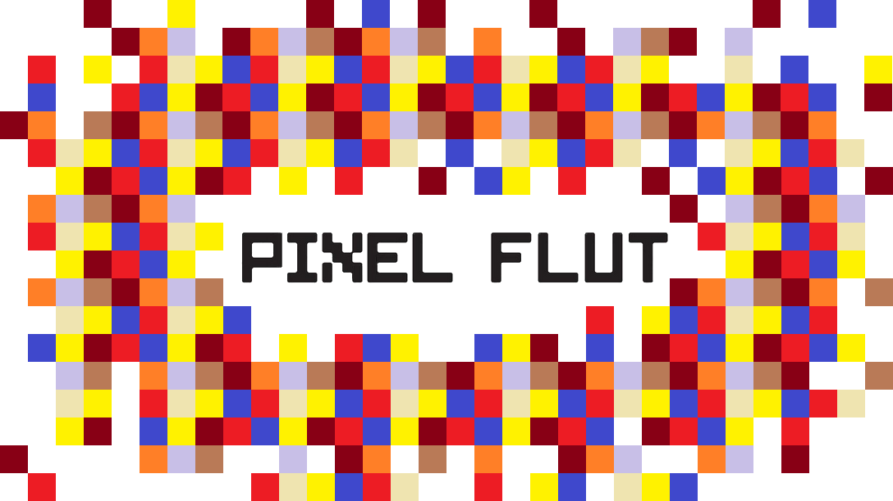

PixelFlut Challenge
===================

Markus Pöschl & Tobias Schaffner

----

:data-x: r2400
:data-y: 0

Sponsor
-------

PIXEL Group GmbH

Simon Ashdown

----

.. image:: images/menu.png

Important things first
----------------------

* Schnitzel will arive at about 8:30 PM.
* Drinks and snacks in the kitchen.

We also have vegetarians covered. ;)

----

.. image:: images/flut_screen.jpg

What is PixelFlut?
------------------

* A digital canvas
* The pixels can be sent and retreived by everybody connected to the server

----

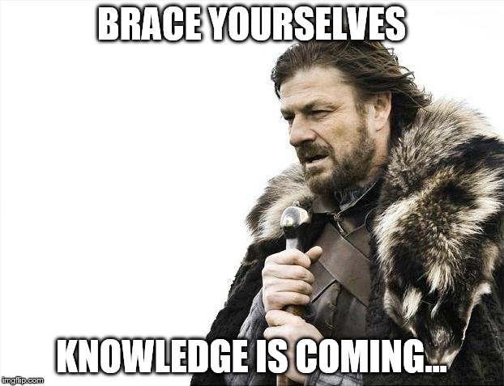

What is this evening about
--------------------------

1. One 4k PixelFlut Server
2. Five challanges
3. Try to solve the challanges faster than the other teams with the language you like
4. ...
5. Profit (Reward)

----

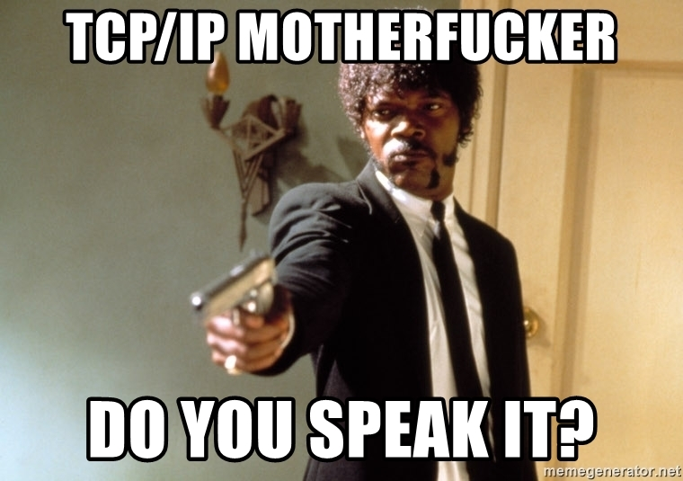

API
---

``\n`` terminated ASCII commands over TCP

* ``SIZE`` - Returns the size of the visible canvas
* ``PX <x> <y>`` - Return the current color of a pixel
* ``PX <x> <y> <rrggbb>`` - Set the color of a pixel

https://github.com/defnull/pixelflut

----

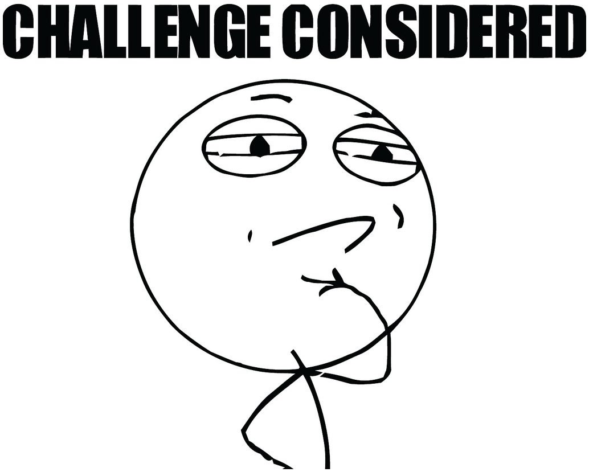

Challenges
----------

1. Color Spectrum
2. Pacman
3. Minified Maze
4. "Deal with it"
5. Solve the maze

----

:data-x: r0
:data-y: r1000

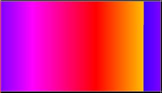

Color Spectrum
--------------

* Draw the color spectrum of the RGB range
* Rotate it

----

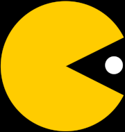

Pacman
------

* Draw a pacman that opens and closes its mouth
* Every second time it open the mouth a yellow dot should be shown

----

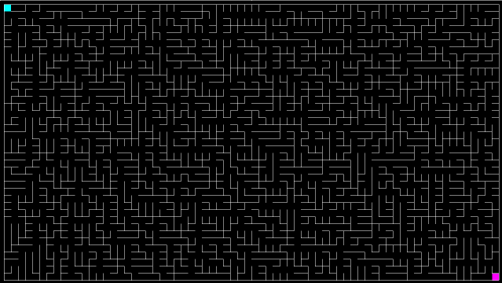

Minified Maze
-------------

* Copy the maze from the middle of the screen.
* Scale it to the size of your target area.
* Solution should not be blurry!

----

:id: deal-with-it

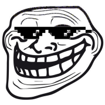

"Deal with it"
--------------

* Search a random (random) animal picture and draw it
* Use the provided glasses .png
* Animate them moving down to the eyes of the animal
* Background has to be restored behind the moving animation

----

Maze
----

* Solve the maze 
* It gets regenerated every 60 seconds
* Draw a ``2px`` line from start left top to end right bottom
* The space inside one cell is ``16 x 16 px``
* Use the number of your group as a offset for the lines.
* Color of the start patch: ``#00FFFF``
* Color of the finish patch: ``#FF00FF``

----

:data-x: r2400
:data-y: r0

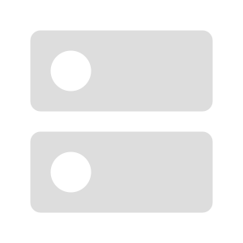

Challenge - Server
------------------

* IP: ``10.201.77.102``
* Port: ``1234``

Playground - Server
-------------------

* IP: ``10.201.77.104``
* Port: ``1234``

----

:id: areas

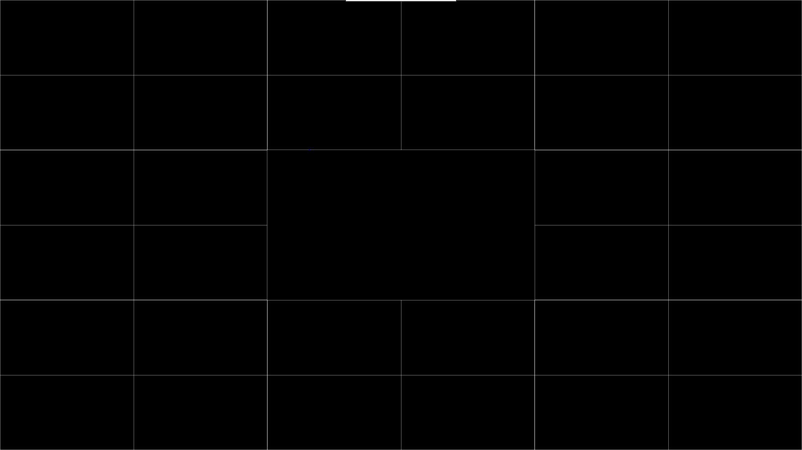

Areas
-----

* The canvas is split into 9 equal areas
* Each group canvas therefore is ``(3840 / 3) x (2160 / 3)``
* Each group canvas is split into four challenge areas.
* On the sides of each area is a ``1px`` border.

----

.. image:: images/rules.jpg
   :height: 600px

Rules
-----

* Only use the group area of your team.
* There is a ``1px`` border around your group area. Don't overwrite it.
* Open one TCP connection per machine and reuse it!
* Please speak to us when the first four challenges are solved and you are starting the maze. We will color your area green, when solved.

----

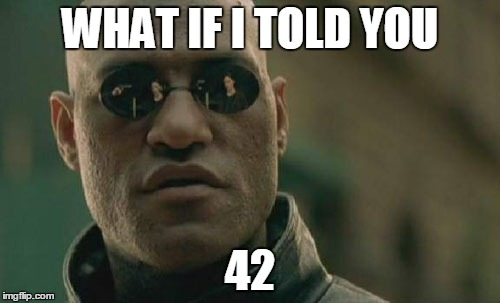

Questions
---------

Any questions so far?

----

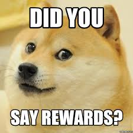

Reward
------

The first Team which completes the 4 animated challenges and draws a line through the maze wins.

----

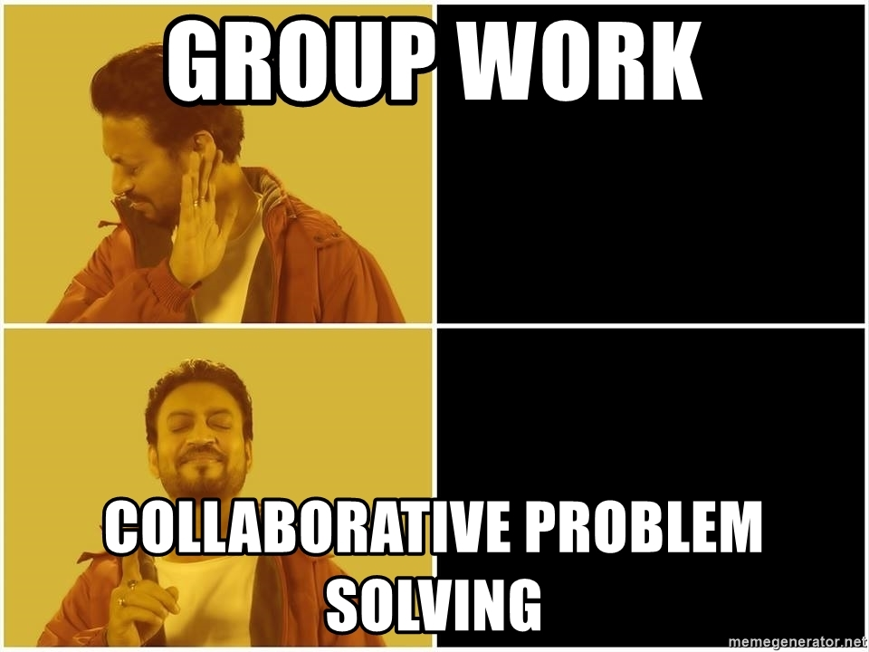

Grouping
--------

We would like you to form groups with 2-3 people.

Colorcodes for the maze:

1. ``#ff0000``
2. ``#00ff00``
3. ``#0000ff``
4. ``#ffff00``
5. ``#c0c0c0``
6. ``#ff0000``
7. ``#808000``
8. ``#800080``

