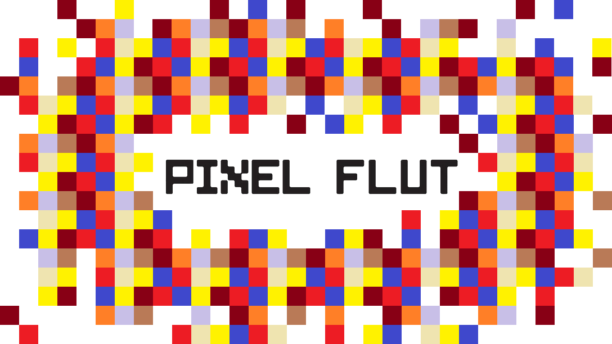
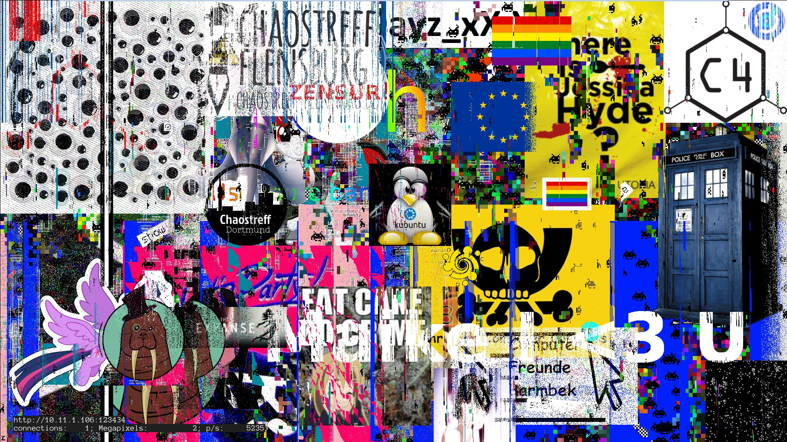

:css: style.css

.. title:: PixelFlut Challenge

----

:data-x: 0
:data-y: 0
:data-scale: 1

PixelFlut Challenge
===================

Markus Poeschl & Tobias Schaffner

----

:data-x: r2400
:data-y: 0

Sponsor
-------

Simon Ashdown

Pixel Group GmbH

----

Important things first
----------------------

* Schnitzel will arive at about 8:30 PM.

We also have vegetarians covered. ;)

----

What is PixelFlut?
------------------

* A digital canvas
* The pixels can be sent and retreived by everybody connected to the server

----

What is this evening about
--------------------------

1. One 4k PixelFlut Server
2. Five challanges
3. Try to solve the challanges faster than the other Teams with the language you like
4. ...
5. Profit (Reward)

----

API
---

``\n`` terminated ASCII commands over TCP

* ``SIZE`` - Returns the size of the visible canvas
* ``PX <x> <y>`` - Return the current color of a pixel
* ``PX <x> <y> <rrggbb>`` - Set the color of a pixel

https://github.com/defnull/pixelflut

----

Challenges
----------

1. Color Spectrum
2. Pacman
3. Minified Maze
4. "Deal with it"
5. Solve the maze

----

:data-x: r0
:data-y: r1000

Color Spectrum
--------------

* Draw the color spectrum of the RGB range
* Rotate it

----

Pacman
------

* Draw a pacman that opens and closes its mouth
* Every second time it open the mouth a yellow dot should be shown

----

Minified Maze
-------------

* Copy the maze from the middle of the screen.
* Scale it to the size of your target area.
* Solution should not be blurry!

----

"Deal with it"
--------------

* Search a random (random) animal picture and draw it
* Use the provided glasses .png
* Animate them moving down to the eyes of the animal
* Background has to be restored behind the moving animation

----

Maze
----

* Solve the maze 
* It gets regenerated every 60 seconds
* Draw a ``2px`` line from start left top to end right bottom
* The space inside one cell is ``16 x 16 px``
* Use the number of your group as a offset for the lines.

----

:data-x: r2400
:data-y: r0

Server
------

* IP: ``0.0.0.0``
* Port: ``1234``

----

Areas
-----

* The canvas is split into 9 equal areas
* Each group canvas therefore is ``(3840 / 3) x (2160 / 3)``
* Each group canvas is split into four challenge areas.

----

Rules
-----

* Only use the areas with your Teamnumber.
* There is a ``1px`` boarder around your group area. Don't overwrite it.
* Open one TCP connection and reuse it!
* All challenges has to be moving during the maze solving.
* Please speak to us when the first four challenges are solved and you are starting the maze.

----

Questions
---------

Any questions so far?

----

Reward
------

Some motivation

----

Grouping
--------

We would like you to form groups with 2-3 people.
